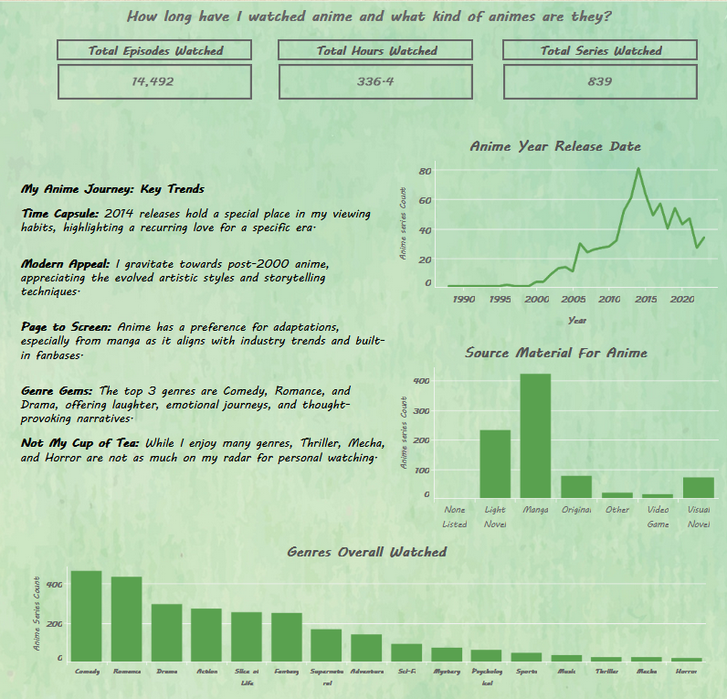
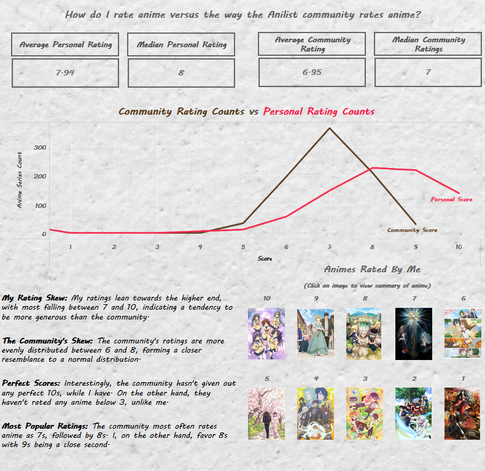
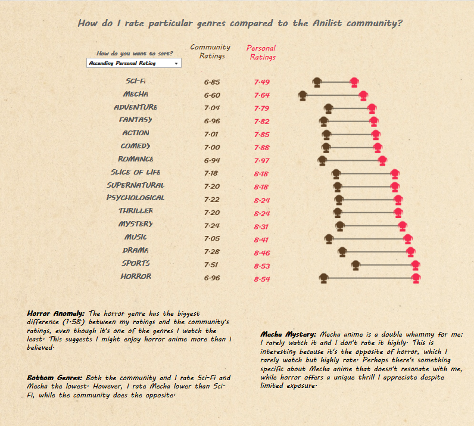

# Anime List Analysis Using Python, GraphQL and Tableau


## Motivation
This project represents an in-depth analysis of my personal anime preferences. My objective was to leverage an API for querying, clean the obtained data, and transform it into actionable insights to address various inquiries I had. Key questions guiding this analysis included:

- <b>What is the total count of series/episodes I've watched?</b>
- <b>Which genres are the most/least frequently watched?</b>
- <b>What are the average scores I've assigned to anime?</b>
- <b>How do my scores compare with the ratings provided by the broader community?</b>

## Background
As a long-time anime enthusiast, I meticulously maintain a record of my favorite anime series on the platform www.anilist.co. Should you wish to explore my profile further, you can find it at [this link](https://anilist.co/user/tetsu1290/animelist).

This practice has sparked my curiosity regarding the alignment between my perceived anime preferences and the data I've accumulated over the years. It's important to note that my anime tastes have evolved over time. All ratings provided reflect my opinion at the moment I completed watching each anime. Ratings assigned a decade ago, for instance, may not necessarily reflect my current sentiments. Various factors, such as the release of new anime, advancements in animation quality, and shifts in personal preferences, contribute to this fluidity in my ratings.

## Working with GraphQL (On a GraphiQL Interface)
Anilist employs a GraphQL database to manage anime-related data on their platform, encompassing user anime lists among other content. A notable advantage of utilizing the GraphQL database on Anilist is its user-friendly search functionality, allowing easy retrieval of a specific user's list by simply knowing their username. It's worth noting that anime lists are considered public information on Anilist, accessible to anyone with knowledge of the username.

Exploring the schema of a GraphQL database can be facilitated through tools like GraphiQL, providing an interface for querying and previewing information before integrating it into platforms such as Jupyter notebooks or other preferred data storage solutions. For a comprehensive guide on this process, I have authored a Medium article detailing how to retrieve anime list data using GraphiQL [here](https://medium.com/@jonathan.roman1213/getting-data-from-anilist-co-for-analysis-part-1-building-a-query-using-graphiql-10b7d6d2e350).

## Visualization and Insights

### Part I
Part I of the dashboard delves into comprehensive anime data analysis, encompassing key metrics such as:

- Total count of episodes, hours, and series watched.
- Chronological distribution of anime series release years.
- Identification of the source material from which the anime originated.
- Analysis of overarching genres consumed.

In the section titled "My Anime Journey: Key Trends," a compilation of the discovered insights derived from this data is presented.


### Part II
Part II delves further into the examination of both my personal ratings and those provided by the community. This entails:

- Calculation of average and median ratings from both my perspective and the broader community.
- Enumeration of occurrences wherein ratings fall within the 1-10 scale.
- Illustrative examples showcasing specific anime titles paired with corresponding ratings (e.g., "Clannad" rated 10, "Arte" rated 9, etc.).

Additionally, insights gleaned from the dashboard image are expounded upon.

### Part III
In the final segment, attention is directed towards scrutinizing ratings according to genre classification. This segment endeavors to address inquiries such as:

- Identification of genres that received the highest and lowest ratings, both from my perspective and the broader community.
- Examination of consensus or discrepancies between community ratings and my own assessments.
- Evaluation of the extent of disparity or alignment in ratings across genres.

The outcomes of this analytical endeavor are elucidated within the dashboard, offering a comprehensive overview of the findings.


## For More Information
If you wish to explore the interactive dashboard firsthand or download the tableau workbook used to make the dashboard, feel free to access it through the provided link.

[Anime Analysis Dashboard on Tableau](https://public.tableau.com/app/profile/jonathan.roman/viz/jonathan_anime_analysis/LongformDashboardEdits)

If you'd like to see the code used to get the data, feel free to access it through the provided link.

[Data Gathering Using Python](/getting_data.ipynb)


## Resources
<b>Code for parsing nested JSON</b>

[Working With Large Nested JSON Data - Ankush Kunwar](https://ankushkunwar7777.medium.com/get-data-from-large-nested-json-file-cf1146aa8c9e)

<b>Where I learned how to query GraphQL </b>

[Graphql Complete Tutorial With Python - Total Technology Zonne](https://www.youtube.com/watch?v=wjA9xh0G3vQ&list=PLI8raxzYtfGxVDsdOBuJvRjMK8n0ffWVb)

<b>Inspiration for visualization</b>

[Genres & Rating | Reading Wrapped '23 - Leah Warner-Tedaldi](https://public.tableau.com/app/profile/leah.warnertedaldi/viz/GenresRatingReadingWrapped23/GenresRatings)

## Additional Info
For additional info, contact Jonathan Roman at [jonathan.roman1213@gmail.com](mailto:jonathan.roman1213@gmail.com)

## Repository Structure

```
├── data
├── images
├── .gitignore
├── README.md
└── getting_data.ipynb
```